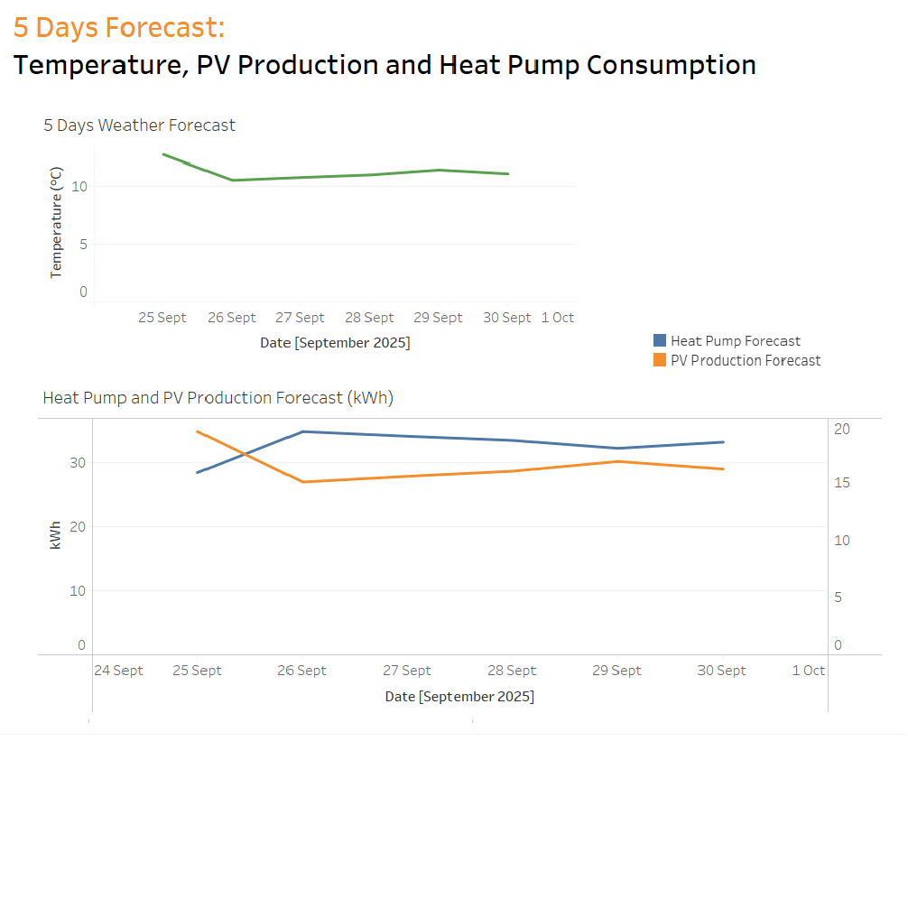

```{r setup, include=FALSE}
# This chunk sets global options for the entire document.
# include=FALSE hides this chunk from the final rendered report.
knitr::opts_chunk$set(
  echo = TRUE,       # Display the R code in the output document
  warning = FALSE,   # Suppress warnings
  message = FALSE,   # Suppress messages
  fig.width = 10,    # Default width for figures in inches    
  fig.height = 6     # Default height for figures in inches
)
```

```{r libraries}
# This chunk loads all the necessary R packages for the analysis.
library(dplyr)
library(readr)
library(tidyr)
library(lubridate)
library(janitor)
library(stringr)
library(ggplot2)
library(patchwork) 
library(scales)
library(kableExtra)
```

# 1. Introduction

The transition to renewable energy sources presents both opportunities and challenges for the modern homeowner. Optimizing the use of technologies like a photovoltaic (PV) system and an electric vehicle (EV) requires a deep understanding of the household's energy consumption patterns,

This analysis examines historical energy and weather data from a single residence in Aarau, Switzerland. By correlating the household's energy consumption with local weather patterns, we aim to develop data-driven recommendations to help the homeowner increase self-consumption of clean energy, reduce costs, and contribute to a more sustainable energy system.

## 1.1 Research Question

This report addresses the following primary research question:

**In what ways can a homeowner in the Canton of Aargau with a photovoltaic system make better environmental and economic decisions by leveraging their own energy data?**

## 1.2 Hypothesis

Based on this question, we formulate the following hypothesis:

A homeowner in the Canton of Aargau can significantly increase their self-consumption of solar energy and reduce grid dependency by implementing data-driven strategies, primarily by aligning flexible consumption loads, like electric vehicle (EV) charging, with peak solar production hours and employing a battery storage system to shift surplus energy to periods of demand.

# 2. Datasets & Datasources

This analysis utilizes two primary data sources: detailed energy data for the household and local weather data. The table below provides a comprehensive overview of each source.

> **Licensing note:** *Von Google lizenziert* where applicable; MeteoSwiss data is provided under the Swiss OGD framework.

| Dataset | Provider | Description | Key variables used |
|------------------|------------------|------------------|------------------|
| **Household Energy Profile** | AEW Energie AG | High‑resolution energy metrics for a residential property (Wynemattestrasse 17) over \~5 years: generation, consumption, and grid interaction. | `pv_production_k_wh` – PV energy production (kWh)<br>`consumption_base_load_k_wh` – Base load (e.g., refrigerator, standby)<br>`consumption_heat_pump_k_wh` – Heat pump consumption<br>`consumption_ev_charging_k_wh` – EV charging consumption<br>`grid_feed_in_pv_k_wh` – Surplus PV fed into grid<br>`grid_import_total_k_wh` – Total grid import |
| **Historical Weather Data** | MeteoSwiss | Hourly weather observations (OGD) used to correlate energy patterns with environmental conditions. | `temperature_c` – Mean air temperature (°C)<br>`humidity_pct` – Mean relative humidity (%)<br>`wind_speed_ms` – Mean wind speed (m/s) |

# 3. Data Wrangling

This section includes the functions and steps to load, clean, process, and merge the datasets.

## 3.1 Function to Load and Process Energy Data

This function is designed to handle the specific format of the AEW energy data. It correctly parses timestamps (including the "24:00" format, which is treated as the start of the next day), cleans column names, and aggregates the data to an hourly resolution.

```{r functions-energy}
load_and_process_energy_data <- function(file_path,
                                         tz_out = "UTC",
                                         aggregate_to_hour = TRUE,
                                         complete_hours = TRUE) {

  energy_long <- read_csv(file_path, show_col_types = FALSE, guess_max = 2e5) %>%
    clean_names() %>%
    rename(ts_raw = timestamp)

  energy_wide <- energy_long %>%
    mutate(
      # Detect and handle "... 24:00" timestamps
      is_24 = str_detect(ts_raw, "(\\s|T)24:00(:00)?$"),
      ts_norm = str_replace(ts_raw, "(\\s|T)24:00(:00)?$", " 00:00:00"),
      timestamp = parse_date_time(ts_norm,
                                  orders = c("ymd HMS","ymd HM","dmy HMS","dmy HM"),
                                  tz = tz_out),
      timestamp = if_else(is_24, timestamp + days(1), timestamp),
      value = suppressWarnings(as.numeric(value))
    ) %>%
    filter(!is.na(timestamp)) %>%
    group_by(timestamp, metric) %>%
    summarise(value = mean(value, na.rm = TRUE), .groups = "drop") %>%
    pivot_wider(names_from = metric, values_from = value) %>%
    clean_names()

  if (aggregate_to_hour) {
    energy_wide <- energy_wide %>% mutate(timestamp = floor_date(timestamp, "hour"))
    kwh_cols  <- grep("_k_wh$", names(energy_wide), value = TRUE)
    other_num <- setdiff(names(energy_wide)[sapply(energy_wide, is.numeric)], kwh_cols)

    energy_wide <- energy_wide %>%
      group_by(timestamp) %>%
      summarise(
        across(all_of(kwh_cols),  ~ sum(.x, na.rm = TRUE)),
        across(all_of(other_num), ~ mean(.x, na.rm = TRUE)),
        .groups = "drop"
      )
  }

  if (complete_hours) {
    energy_wide <- energy_wide %>%
      arrange(timestamp) %>%
      complete(timestamp = seq(from = floor_date(min(timestamp), "hour"),
                               to   = floor_date(max(timestamp), "hour"),
                               by   = "hour"))
  }

  energy_wide %>%
    arrange(timestamp) %>%
    mutate(date = as_date(timestamp))
}
```

## 3.2 Function to Load and Process MeteoSwiss Weather Data

This function loads the semicolon-delimited weather data. It includes a helper to robustly parse numbers that might use either a dot or a comma as a decimal mark.

```{r functions-weather}
# Helper to parse numbers regardless of decimal mark
parse_numeric_smart <- function(x) {
  x_chr <- as.character(x)
  v_dot   <- parse_number(x_chr, locale = locale(decimal_mark = ".", grouping_mark = ","))
  v_comma <- parse_number(x_chr, locale = locale(decimal_mark = ",", grouping_mark = "."))
  if (sum(!is.na(v_comma)) > sum(!is.na(v_dot))) v_comma else v_dot
}

load_and_process_weather_data <- function(file_path_weatherdata,
                                          station = NULL, tz_out = "UTC") {
  weather_raw <- read_delim(
    file_path_weatherdata,
    delim = ";",
    show_col_types = FALSE,
    guess_max = 2e5
  ) %>%
    clean_names() %>%
    rename(
      station       = station_abbr,
      ts_raw        = reference_timestamp,
      temperature_c = tre200h0,
      humidity_pct  = ure200h0,
      wind_speed_ms = fkl010h0
    ) %>%
    mutate(
      timestamp = parse_date_time(ts_raw, orders = c("dmy HM","dmy HMS"), tz = tz_out),
      timestamp = floor_date(timestamp, "hour"),
      date      = as_date(timestamp),
      temperature_c = parse_numeric_smart(temperature_c),
      humidity_pct  = parse_numeric_smart(humidity_pct),
      wind_speed_ms = parse_numeric_smart(wind_speed_ms)
    ) %>%
    filter(!is.na(timestamp), date >= as_date("2020-01-01"))

  weather_raw %>%
    group_by(timestamp) %>%
    summarise(
      temperature_c = mean(temperature_c, na.rm = TRUE),
      humidity_pct  = mean(humidity_pct,  na.rm = TRUE),
      wind_speed_ms = mean(wind_speed_ms, na.rm = TRUE),
      .groups = "drop"
    ) %>%
    arrange(timestamp) %>%
    mutate(date = as_date(timestamp))
}
```

## 3.3 Execute Wrangling and Merging

This chunk executes the functions defined above to load, process, and merge the two datasets into a final, hourly dataframe.

```{r wrangle-merge}
# Define file paths
energy_file  <- "../data/household_energy_profile_Wynemattestrasse_17_5_years.csv"
weather_file <- "../data/ogd-smn_bus_h_historical_2020-2029.csv"

# Process data using the functions
energy_df  <- load_and_process_energy_data(energy_file)
weather_df <- load_and_process_weather_data(weather_file)

# Merge the two dataframes into one
final_df_h <- left_join(energy_df, weather_df, by = "timestamp") %>% 
  select(-date.y) %>% 
  rename(date = date.x)

# Display the first few rows of the final merged dataset
head(final_df_h)

# Save the final hourly dataset to a CSV file
#write_csv(final_df_h, "final_df_h.csv")
```

## 3.4 Daily Aggregation

To analyze broader trends, we aggregate the hourly data into daily summaries. Energy metrics are summed, while weather metrics are averaged for each day.

```{r daily-aggregation}
self_col <- "self_consumption_pv_k_wh"

final_df_d <- final_df_h %>%
  group_by(date) %>%
  summarise(
    # Energy (sum over 24 hours per day)
    pv_production_k_wh = sum(pv_production_k_wh, na.rm = TRUE),
    consumption_base_load_k_wh = sum(consumption_base_load_k_wh, na.rm = TRUE),
    consumption_heat_pump_k_wh = sum(consumption_heat_pump_k_wh, na.rm = TRUE),
    consumption_ev_charging_k_wh = sum(consumption_ev_charging_k_wh, na.rm = TRUE),
    grid_feed_in_pv_k_wh = sum(grid_feed_in_pv_k_wh, na.rm = TRUE),
    grid_import_total_k_wh = sum(grid_import_total_k_wh, na.rm = TRUE),
    self_consumption_pv_k_wh = if (self_col %in% names(final_df_h)) sum(.data[[self_col]], na.rm = TRUE) else NA_real_,
    
    # Weather (daily averages)
    temperature_daily_C = mean(temperature_c, na.rm = TRUE),
    humidity_daily_pct = mean(humidity_pct, na.rm = TRUE),
    wind_speed_daily_ms = mean(wind_speed_ms, na.rm = TRUE)
  ) %>%
  ungroup()

# display the first few rows 
#head(final_df_d)

# Save the daily data 
write_csv(final_df_d, "final_df_d.csv")
```

# 4. Exploratory Data Analysis (EDA)

## 4.1 Time Series Visualization: Hourly Data

The following plots show the behavior of key energy and weather variables over the entire time period. This is useful for identifying seasonality, trends, and potential anomalies.

```{r, time-series-plots-hourly, fig.height=18}
# Define the list of variables to plot
plot_vars <- c(
  "consumption_base_load_k_wh", "consumption_heat_pump_k_wh",
  "consumption_ev_charging_k_wh", "grid_feed_in_pv_k_wh",
  "grid_import_total_k_wh", "self_consumption_pv_k_wh",
  "pv_production_k_wh", "temperature_c", "humidity_pct", "wind_speed_ms"
)

# create a list of plots
plots <- lapply(plot_vars, function(var) {
  if (!var %in% names(final_df_h)) return(NULL)
  ggplot(final_df_h, aes(x = timestamp, y = .data[[var]])) +
    geom_line(linewidth = 0.5) +
    labs(title = var, x = "Time - hourly", y = "Value") +
    theme_minimal(base_size = 16) +
    theme(
      plot.title = element_text(size = 18, face = "bold"),
      axis.title = element_text(size = 16),
      axis.text = element_text(size = 14)
    )
})

# remove NULLs (in case some variables are absent)
plots <- Filter(Negate(is.null), plots)

# arrange all plots in a grid for easier comparison
wrap_plots(plots, ncol = 2)
```

As shown in the plots of consumption and grid transaction variables against hourly timestamps, there are pronounced annual seasonal patterns in several key metrics, including heat pump consumption, grid feed-in from PV, total grid import, and self-consumption of PV. These patterns are primarily driven by seasonal weather conditions. For example, heat pump consumption peaks during the winter months and reaches its lowest levels in summer. In contrast, photovoltaic (PV) production is concentrated between April and October, with output during the winter months dropping to nearly zero. This seasonal variation in PV production also shapes the dynamics of both grid feed-in and self-consumption of PV.

Additionally, the chart for EV charging consumption shows that an electric vehicle was introduced into the system starting in 2023. Ideally, EV charging demand should be aligned with PV production, so that charging is supplied as much as possible by locally generated solar electricity.

## 4.2 Time Series Visualization: Daily Data

Additionally, the hourly data is converted into daily data, enabling clearer identification of long-term seasonal patterns, reducing short-term noise, and facilitating comparisons across years.

```{r, time-series-plots-daily, fig.height=18}
# define the list of variables to plot
plot_vars_d <- c(
  "consumption_base_load_k_wh", "consumption_heat_pump_k_wh",
  "consumption_ev_charging_k_wh", "grid_feed_in_pv_k_wh",
  "grid_import_total_k_wh", "self_consumption_pv_k_wh",
  "pv_production_k_wh", "temperature_daily_C", "humidity_daily_pct", "wind_speed_daily_ms"
)

# create a list of plots
plots <- lapply(plot_vars_d, function(var) {
  if (!var %in% names(final_df_d)) return(NULL)
  ggplot(final_df_d, aes(x = date, y = .data[[var]])) +
    geom_line(linewidth = 0.5) +
    labs(title = var, x = "Time - Daily", y = "Value") +
    theme_minimal(base_size = 16) +
    theme(
      plot.title = element_text(size = 18, face = "bold"),
      axis.title = element_text(size = 14),
      axis.text = element_text(size = 14)
    )
})

# remove NULLs (in case some variables are absent)
plots <- Filter(Negate(is.null), plots)

# arrange all plots in a grid for easier comparison
wrap_plots(plots, ncol = 2)

```

The daily plots confirm strong seasonal effects in both consumption and PV-related variables, consistent with weather-driven dynamics. Base load demand remains stable, while EV charging appears irregular and only from 2023 onward. Environmental variables show expected patterns: temperature cycles annually, humidity stays relatively stable, and wind speed is highly variable with occasional peaks.

## 4.3 Time Series Visualization Monthly Energy Balance

For the monthly balance, the hourly data was aggregated into monthly totals, separating PV production, grid transactions, and consumption categories. This aggregation smooths out daily fluctuations and highlights seasonal trends, such as higher PV generation in summer and increased heat pump demand in winter. It also makes the overall energy balance between production, self-consumption, feed-in, and imports easier to interpret.

```{r, Monthly Energy Balance}


# Aggregate monthly 
monthly_summary <- final_df_d %>%
  mutate(year = year(date),
         month = floor_date(date, "month")) %>%
  group_by(year, month) %>%
  summarise(
    pv_production_kwh       = sum(pv_production_k_wh, na.rm = TRUE),
    grid_import_total_kwh   = sum(grid_import_total_k_wh, na.rm = TRUE),
    grid_feed_in_pv_kwh     = sum(grid_feed_in_pv_k_wh, na.rm = TRUE),
    self_consumption_pv_kwh = sum(self_consumption_pv_k_wh, na.rm = TRUE),
    consumption_base_kwh    = sum(consumption_base_load_k_wh, na.rm = TRUE),
    consumption_heat_kwh    = sum(consumption_heat_pump_k_wh, na.rm = TRUE),
    consumption_ev_kwh      = sum(consumption_ev_charging_k_wh, na.rm = TRUE),
    .groups = "drop"
  )

# Reshape and set sign convention
monthly_long <- monthly_summary %>%
  pivot_longer(-c(year, month), names_to = "category", values_to = "kwh") %>%
  mutate(
    category = recode(category,
      pv_production_kwh       = "PV production",
      grid_import_total_kwh   = "Grid import",
      grid_feed_in_pv_kwh     = "Grid feed-in",
      self_consumption_pv_kwh = "Self-consumption PV",
      consumption_base_kwh    = "Base consumption",
      consumption_heat_kwh    = "Heat pump consumption",
      consumption_ev_kwh      = "EV charging"
    ),
    # Flip signs: consumption + feed-in are negative
    kwh = case_when(
      category %in% c("PV production", "Grid import") ~  kwh,
      TRUE                                           ~ -kwh
    )
  )

# Plot 
ggplot(monthly_long, aes(x = month, y = kwh, fill = category)) +
  geom_col(position = "stack", width = 25) +
  scale_y_continuous(labels = label_number(scale_cut = cut_si("k"))) +
  scale_fill_brewer(palette = "Paired") +
  labs(
    title = "Monthly Energy Balance",
    x = "Month",
    y = "kWh",
    fill = " "
  ) +
  theme_minimal(base_size = 14) +
  theme(
    plot.title = element_text(size = 18, face = "bold"),
    axis.title = element_text(size = 14),
    axis.text  = element_text(size = 12),
    legend.position = "bottom"
  )

```

The monthly energy balance chart highlights the interplay between production (positive) and consumption(negative) over time. PV production dominates in the summer months, driving both higher grid feed-in and greater self-consumption, while nearly disappearing in winter. Conversely, heat pump consumption rises sharply in the colder months, contributing to increased grid import during this period. Base consumption remains relatively stable, while EV charging becomes visible only after 2023, adding irregular but notable demand. Overall, the chart illustrates strong seasonal dependencies and the complementary relationship between PV generation and energy demand.

# 5. Sustainability Analysis and Optimization Strategies

## 5.1 Question 1: PV Production Efficiency

The `Daily Consumption Breakdown vs PV Production` illustrates daily breakdown of electricity consumption components—base load, heat pump, and EV charging—in relation to photovoltaic (PV) production between 2020 and 2024. Heat pump consumption displays a strong seasonal pattern, with demand peaking in the winter months and declining almost entirely during summer. In contrast, PV production follows the opposite trend, reaching its highest levels between April and October while dropping to near zero in winter. The comparison highlights a clear seasonal mismatch between PV generation and heating demand, where reliance on grid imports is greatest in winter when PV output is minimal, and opportunities for self-consumption and grid feed-in are concentrated in the sunnier months.

```{r, Daily Consumption Breakdown vs PV}
plot_df <- final_df_d %>%
  select(date,
         consumption_base_load_k_wh,
         consumption_heat_pump_k_wh,
         consumption_ev_charging_k_wh,
         pv_production_k_wh) %>%
  pivot_longer(-date, names_to = "series", values_to = "kwh")

# Mark consumption vs PV
plot_df$type <- ifelse(grepl("consumption", plot_df$series), "Consumption", "PV")

ggplot() +
  # Stacked area for consumption
  geom_area(
    data = filter(plot_df, type == "Consumption"),
    aes(x = date, y = kwh, fill = series),
    alpha = 0.7
  ) +
  # Line for PV production
  geom_line(
    data = filter(plot_df, type == "PV"),
    aes(x = date, y = kwh, color = series),
    linewidth = 0.8
  ) +
  labs(
    title = "Daily Consumption Breakdown vs PV Production",
    x = "Time - Daily",
    y = "kWh",
    fill = " ",
    color = NULL
  ) +
  theme_minimal(base_size = 16) +
  theme(
    plot.title = element_text(size = 24, face = "bold"),
    axis.title = element_text(size = 18),
    axis.text  = element_text(size = 14),
    legend.position = "bottom",
    legend.box = "horizonal",
    legend.margin = margin(t=8),
    legend.text     = element_text(size = 12),   # legend labels
    legend.title    = element_text(size = 12),   # legend title
    plot.margin = margin(b=20)
    )
```

`Daily Consumption Breakdown vs PV Production` presents the yearly breakdown of daily consumption components compared with PV production from 2020 to 2024. The seasonal patterns remain consistent across years, with PV production peaking in summer and heat pump demand dominating in winter. However, the charts reveal that only a limited share of PV production is directly used for self-consumption, as base load and EV charging demand remain relatively small compared to the PV output during sunny months. This mismatch indicates that much of the solar generation is likely exported to the grid rather than consumed locally. Additionally, a noticeable dip in consumption between July and August suggests a vacation period, where overall demand temporarily decreases while PV generation remains high.

```{r, Daily Consumption Breakdown vs PV2, fig.height=18}


plot_df <- final_df_d %>%
  mutate(year = as.integer(format(date, "%Y"))) %>%   # add year
  select(date, year,
         consumption_base_load_k_wh,
         consumption_heat_pump_k_wh,
         consumption_ev_charging_k_wh,
         pv_production_k_wh) %>%
  pivot_longer(-c(date, year), names_to = "series", values_to = "kwh") %>%
  mutate(type = ifelse(grepl("consumption", series), "Consumption", "PV"))

ggplot() +
  # Stacked area for consumption
  geom_area(
    data = dplyr::filter(plot_df, type == "Consumption"),
    aes(x = date, y = kwh, fill = series),
    alpha = 0.7
  ) +
  # Line for PV production
  geom_line(
    data = dplyr::filter(plot_df, type == "PV"),
    aes(x = date, y = kwh, color = series),
    linewidth = 0.8
  ) +
  labs(
    title = "Daily Consumption Breakdown vs PV Production",
    x = "Time - Daily",
    y = "kWh",
    fill = " ",
    color = NULL
  ) +
  facet_wrap(~ year, ncol = 1, scales = "free_x") +  # 5 vertical panels
  theme_minimal(base_size = 24) +
  theme(
    plot.title = element_text(size = 24, face = "bold"),
    axis.title = element_text(size = 16),
    axis.text  = element_text(size = 16),
    strip.text = element_text(size = 16, face = "bold"),
    legend.position = "bottom",      # outside the plot area
    legend.box = "horizontal",
    legend.margin = margin(t = 8),
    legend.text     = element_text(size = 12),   # legend labels
    #legend.title    = element_text(size = 12),   # legend title
    plot.margin = margin(b = 30)
  ) +
  guides(
    fill  = guide_legend(nrow = 2, byrow = TRUE),
    color = guide_legend(nrow = 2, byrow = TRUE, order = 2)
  )

```

The table `Seasonal PV Production by Year` shows that autumn and winter PV production is extremely low, about 0–3% of the summer level each year, almost negligible output during 6 months, while spring production reaches roughly 43–48% of summer. Several sources estimate that PV systems in temperate latitudes produce 40–60% less energy in winter than in summer. For example, Lighthouse Solar reports a drop of 40-60% for solar power in December/January compared to July/August @LighthouseSolar2017. In comparison, the winter PV production in our case is significantly lower than the average expectation, suggesting potential system or site-specific inefficiencies. There are several possible explanations:

-   The solar panels may be mounted at a tilt angle optimized for summer sun but not ideal for capturing low-angle winter sunlight, which reduces winter generation dramatically @Nahim2025; @EnergyGovWinter.

-   In addition, weather factors such as cloud cover, snow, and shorter daylight hours further cut winter production @Amusan2019; @Mokhtari2021.

-   Panel efficiency under cold, low-light conditions might also be less than expected, if the equipment or orientation isn't optimized for those conditions @Sarmah2023; @Shaker2024.

```{r}
# Define seasons manually 
get_season <- function(dates) {
  m <- month(dates)
  ifelse(m %in% 3:5,  "Spring",
  ifelse(m %in% 6:8,  "Summer",
  ifelse(m %in% 9:11, "Autumn", "Winter")))
}

# build table (numeric, rounded)
season_summary_tbl <- final_df_d %>%
  mutate(year = year(date),
         season = get_season(date)) %>%
  group_by(year, season) %>%
  summarise(pv_total_kwh = sum(pv_production_k_wh, na.rm = TRUE), .groups = "drop") %>%
  group_by(year) %>%
  mutate(ratio_to_summer = pv_total_kwh / max(pv_total_kwh, na.rm = TRUE) * 100) %>%
  ungroup() %>%
  mutate(
    # order seasons 
    season = factor(season, levels = c("Spring","Summer","Autumn","Winter")),
    pv_total_kwh    = round(pv_total_kwh, 2),
    ratio_to_summer = round(ratio_to_summer, 2)
  ) %>%
  arrange(year, season)

# table with kableExtra
season_summary_tbl %>%
  mutate(year = as.character(year)) %>%
  knitr::kable(
    caption = "Seasonal PV Production by Year",
    col.names = c("Year", "Season", "PV total (kWh)", "Ratio to Summer (%)"),
    align = c("c","l","r","r"),
    booktabs = TRUE,
    format.args = list(big.mark = ",", scientific = FALSE)
  ) %>%
  kableExtra::kable_styling(full_width = T, bootstrap_options = c("striped","hover")) %>%
  kableExtra::collapse_rows(columns = 1, valign = "top")
```

**Optimization Suggestions:** Based on the PV production analysis, the results indicate that the solar panels generate substantially less energy during the autumn and winter seasons compared to reference in the same region. This points to a fundamental inefficiency in the current system configuration. Consequently, there is considerable potential for optimization. Possible strategies include:

-- Adjusting panel tilt or orientation to better capture low-angle winter sunlight, or considering dual-tilt/adjustable mounting systems.

-- Installing higher-efficiency modules designed for low-light conditions, which can improve energy yield during cloudy or short-day periods.

-- Regular maintenance and snow management to prevent shading or coverage that can drastically reduce winter output.

-- Integrating storage solutions (e.g., batteries) or load shifting strategies to maximize the use of PV energy when production is highest.

Implementing such measures could reduce the seasonal mismatch between generation and demand, improve self-consumption, and increase the overall sustainability and resilience of the system.

## 5.2 Question 2: EV Charing Efficiency

The introduction of an EV in 2023 presents a major opportunity to increase self-consumption. The key is to align its charging schedule with peak PV production. The plots below explore the energy balance and how the EV fits in.

```{r, fig.height=12}
# ---- Prepare data for Plot 3 ----
df3 <- final_df_h %>%
  mutate(year = year(timestamp), month = month(timestamp)) %>%
  # choose your window: Apr–Jul; change to month == 4 if you only want April
  filter(year %in% c(2022, 2024), month == 4) %>%
  transmute(
    timestamp, year,
    base = consumption_base_load_k_wh,
    heat = consumption_heat_pump_k_wh,
    ev   = consumption_ev_charging_k_wh,
    pv   = pv_production_k_wh
  ) %>%
  mutate(across(c(base, heat, ev, pv), ~replace_na(., 0)),
         total_cons = base + heat + ev,
         net = pv - total_cons)

# Consumption components (as negatives for stacking)
cons_long <- df3 %>%
  select(timestamp, year, base, heat, ev) %>%
  pivot_longer(-c(timestamp, year), names_to = "component", values_to = "kwh") %>%
  mutate(kwh = -kwh)   # show below zero

# ---- Plot 3: PV – Consumption (with breakdown) ----
p_balance <- ggplot() +
  # stacked negative areas = consumption breakdown
  geom_area(
    data = cons_long,
    aes(x = timestamp, y = kwh, fill = component),
    alpha = 0.7
  ) +
  # PV production as a line (positive)
  geom_line(
    data = df3,
    aes(x = timestamp, y = pv, color = "PV production"),
    linewidth = 0.6
  ) +
  # Net balance line
  geom_line(
    data = df3,
    aes(x = timestamp, y = net, linetype = "Net (PV - total consumption)"),
    linewidth = 0.7
  ) +
  facet_wrap(~ year, ncol = 1, scales = "free_x") +
  scale_x_datetime(date_breaks = "1 day", date_labels = "%d-%b") +
  labs(
    title = "PV Minus Consumption (with Component Breakdown)",
    x = "Month",
    y = "kWh",
    fill = "Consumption type",
    color = NULL,
    linetype = NULL
  ) +
  theme_minimal(base_size = 24) +
  theme(
    plot.title = element_text(size = 24, face = "bold"),
    axis.title = element_text(size = 24),
    axis.text  = element_text(size = 10, angle = 90),
    strip.text = element_text(size = 24, face = "bold"),
    legend.position = "bottom",
    legend.box = "horizontal",
    legend.text = element_text(size = 12),
    legend.title = element_text(size = 12),
    plot.margin = margin(t = 8, b = 14)
  ) +
  guides(
    linetype = guide_legend(nrow = 1, byrow = TRUE),
    fill     = guide_legend(nrow = 1, byrow = TRUE, override.aes = list(size = 6)),
    color    = guide_legend(nrow = 1, byrow = TRUE, order = 3)
  )
# If you already have p_cons and p_pv from earlier:
# p_cons / p_pv / p_balance

p_balance
```

The comparison of April 2022 (before the EV) and April 2024 (with the EV) is revealing. In 2024, the intermittent, high-power EV charging events are clearly visible. Crucially, many of these charging sessions occur during daylight hours when the "Net" energy line is positive, meaning they are successfully absorbing surplus solar power that would have otherwise been fed to the grid. However, some charging also occurs in the evening, increasing the negative net balance and reliance on grid imports. This highlights the opportunity for optimization: scheduling all EV charging to coincide with peak solar production.

```{r}

# ==== 1) Aggregate hourly -> annual ====
annual <- final_df_h %>%
  mutate(year = year(timestamp)) %>%
  group_by(year) %>%
  summarise(
    pv_production_k_wh      = sum(pv_production_k_wh,      na.rm = TRUE),
    self_consumption_pv_k_wh= sum(self_consumption_pv_k_wh,na.rm = TRUE),
    grid_feed_in_pv_k_wh    = sum(grid_feed_in_pv_k_wh,    na.rm = TRUE),
    grid_import_total_k_wh   = sum(grid_import_total_k_wh,   na.rm = TRUE),
    .groups = "drop"
  ) %>%
  # quick check that PV = self + feed-in (report the diff)
  mutate(check_diff_kwh = pv_production_k_wh - (self_consumption_pv_k_wh + grid_feed_in_pv_k_wh))

# (optional) print discrepancies if any
if (any(abs(annual$check_diff_kwh) > 1e-6)) {
  message("Warning: PV != Self + Feed-in for some years. Diff (kWh):")
  print(annual[, c("year", "check_diff_kwh")])
}

# Long format for stacked bars
bars_long <- annual %>%
  select(year, self_consumption_pv_k_wh, grid_feed_in_pv_k_wh) %>%
  pivot_longer(-year, names_to = "component", values_to = "kwh") %>%
  mutate(
    component = recode(component,
      self_consumption_pv_k_wh = "Self-consumption",
      grid_feed_in_pv_k_wh     = "Grid feed-in"
    )
  )

# ==== 2) Plot: stacked bars + overlay line ====
ggplot() +
  # Stacked bars = PV breakdown
  geom_col(
    data = bars_long,
    aes(x = factor(year), y = kwh, fill = component),
    position = "stack", width = 0.7
  ) +
  # Optional label of total PV on top of the stack
  geom_text(
    data = annual,
    aes(x = factor(year),
        y = pv_production_k_wh,
        label = scales::comma(round(pv_production_k_wh))),
    vjust = -0.4, size = 4
  ) +
  # Grid import overlay (line + points)
  geom_line(
    data = annual,
    aes(x = factor(year), y = grid_import_total_k_wh, group = 1, color = "Grid import (total)"),
    linewidth = 1
  ) +
  geom_point(
    data = annual,
    aes(x = factor(year), y = grid_import_total_k_wh, color = "Grid import (total)"),
    size = 2.2
  ) +
  # If grid import is much smaller/larger than PV and you want a 2nd y-axis, uncomment:
  # scale_y_continuous(labels = label_number_si(),
  #                    sec.axis = sec_axis(~ ., name = "Grid import (kWh)")) +
  scale_y_continuous(labels = label_number(scale_cut = cut_si("k"))) +
  scale_fill_brewer(palette = "Pastel1") +
  scale_color_manual(values = c("Grid import (total)" = "black")) +
  labs(
    title = "Annual PV Production Breakdown with Grid Import Overlay",
    x = "Year",
    y = "kWh",
    fill = "PV production = Self-consumption + Grid feed-in",
    color = NULL
  ) +
  theme_minimal(base_size = 16) +
  theme(
    plot.title = element_text(size = 20, face = "bold"),
    legend.position = "bottom",
    legend.box = "vertical",
    legend.text = element_text(size = 12)
  )

```

## 5.3 Battery Storage Potential

To assess the viability of a battery storage system, we need to understand the daily energy surplus and deficit. A surplus occurs when PV production exceeds total household consumption, and this excess energy could be used to charge a battery instead of being sold to the grid. A deficit occurs when consumption is higher than production, requiring energy from the grid or, potentially, from a battery.

The plot below calculates the total surplus (charge potential) and deficit (discharge demand) for each day over the entire period.

```{r}
# 1. Calculate hourly net energy (production - consumption)
hourly_net <- final_df_h %>%
  mutate(across(where(is.numeric), ~replace_na(., 0))) %>%
  mutate(
    total_consumption = consumption_base_load_k_wh + 
                        consumption_heat_pump_k_wh + 
                        consumption_ev_charging_k_wh,
    net_kwh = pv_production_k_wh - total_consumption
  )

# 2. Aggregate daily surplus/deficit and calculate cumulative surplus per year
daily_battery_potential <- hourly_net %>%
  group_by(date) %>%
  summarise(
    charge_potential_kwh = sum(net_kwh[net_kwh > 0]),
    discharge_demand_kwh = abs(sum(net_kwh[net_kwh < 0])), # abs() here is cleaner
    .groups = "drop"
  ) %>%
  # Arrange by date and calculate the cumulative sum, resetting each year
  arrange(date) %>%
  group_by(year = year(date)) %>%
  mutate(
    cumulative_surplus_kwh = cumsum(charge_potential_kwh)
  ) %>%
  ungroup()

# 3. Define a scaling factor for the secondary axis
# This helps both geoms appear clearly on the plot
scaling_factor <- max(daily_battery_potential$cumulative_surplus_kwh) / max(daily_battery_potential$charge_potential_kwh, na.rm = TRUE)

# 4. Plot the results with the new cumulative area
ggplot(daily_battery_potential, aes(x = date)) +
  # Add the cumulative surplus as a filled area plot
  geom_area(
    aes(y = cumulative_surplus_kwh / scaling_factor, fill = "Cumulative Annual Surplus"),
    alpha = 0.3
  ) +
  # Keep the daily potential and demand as lines
  geom_line(aes(y = charge_potential_kwh, color = "Daily Surplus (Charge Potential)"), linewidth = 0.8) +
  geom_line(aes(y = discharge_demand_kwh, color = "Daily Deficit (Discharge Demand)"), linewidth = 0.8) +
  
  # Add manual scales for colors and fill
  scale_color_manual(values = c(
    "Daily Surplus (Charge Potential)" = "darkgreen",
    "Daily Deficit (Discharge Demand)" = "darkred"
  )) +
  scale_fill_manual(values = c(
    "Cumulative Annual Surplus" = "steelblue"
  )) +
  
  # Define the primary and secondary y-axes
  scale_y_continuous(
    name = "Daily Energy (kWh)",
    sec.axis = sec_axis(~ . * scaling_factor, name = "Cumulative Annual Surplus (kWh)")
  ) +
  
  # Add informative labels and title
  labs(
    title = "Daily and Cumulative Annual Potential for Battery Storage",
    subtitle = "Lines show daily energy surplus/deficit; Area shows total accumulated surplus each year.",
    x = "Date",
    color = "Daily Metric",
    fill = "Annual Metric"
  ) +
  
  # Apply consistent theme
  theme_minimal(base_size = 16) +
  theme(
    plot.title = element_text(size = 20, face = "bold"),
    axis.title = element_text(size = 14),
    axis.text = element_text(size = 12),
    legend.position = "bottom",
    legend.box = "vertical",
    legend.margin = margin(t = 10)
  )

```

The plot clearly shows the same strong seasonal pattern observed earlier.

-   Charge Potential (Green Line): During summer, there are frequent days with over 20 kWh of surplus energy—energy that is currently being fed to the grid but could be stored in a battery. This potential disappears almost completely in winter.
-   Discharge Demand (Red Line): This represents the energy needed from the grid (or a battery) when PV is not producing. In summer, the daily deficit is relatively low, often under 10 kWh, covering evening and nighttime loads. In winter, this deficit skyrockets due to the heat pump, far exceeding any potential for charging.

This visualization confirms that a battery would be highly effective during the spring, summer, and autumn months for absorbing midday surplus and covering evening/night demand.

Recommendations for Battery System: Based on the analysis, a residential battery storage system is a highly recommended investment for this household.

Recommended Capacity: **10-15 kWh.**

-   On typical sunny days, the surplus energy is between 15 and 25 kWh. A battery in the 10-15 kWh range would be large enough to capture a significant portion of this daily surplus without being oversized. An oversized battery would be underutilized and not cost-effective.
-   This capacity would be sufficient to cover the typical summer evening and nighttime deficit of 5-10 kWh, making the house nearly self-sufficient on sunny days.

Operational Strategy:

-   Charging: The system should be programmed to prioritize charging from surplus solar energy during peak production hours (approx. 10 AM to 4 PM).

-   Discharging: The battery should discharge to cover the household load when solar production ceases in the late afternoon and overnight. This maximizes self-consumption.

-   EV Charging Integration: Integrating the EV charger with the battery system would be ideal. The system could be set to charge the EV from solar surplus first, then use any remaining surplus to charge the home battery.

**Limitations and Expectations:** A battery will not solve the winter energy deficit. The lack of solar production in winter means there will be no energy to store. The household will still rely heavily on the grid during the coldest months to power the heat pump. - However, for the roughly 8-9 months of the year with significant solar production, a battery can dramatically increase energy self-consumption from around 30-40% to potentially over 70-80%, leading to significant cost savings and reduced grid reliance.

# 6. Modeling

To gain a first impression of how the weather variables influence our energy variables, we created a pairs plot that visualizes the relationships between each variable.

```{r}
# Choose only numerical variables (no date or address)
num_vars <- final_df_d[, c("pv_production_k_wh",
                           "consumption_base_load_k_wh",
                           "consumption_heat_pump_k_wh",
                           "consumption_ev_charging_k_wh",
                           "consumption_cooking_lighting_etc_k_wh",
                           "grid_feed_in_pv_k_wh",
                           "grid_import_total_k_wh",
                           "self_consumption_pv_k_wh",
                           "temperature_daily_C",
                           "humidity_daily_pct",
                           "wind_speed_daily_ms")]

# Scatterplot-Matrix
pairs(num_vars)
```

The pairs plot shows several important relationships. PV production and grid feed-in PV are strongly correlated, which is expected because excess solar power is usually fed directly into the grid. Heat pump consumption shows a clear negative relationship with temperature: when the weather is warmer, the heat pump uses less energy. In contrast, PV production is positively related to temperature, as higher temperatures generally coincide with more sunlight. Other variables such as humidity and wind speed do not show strong patterns with consumption or production. Based on these observations, temperature was chosen as the main predictor variable later for the dashboard, since it is strongly linked to both heat pump consumption and PV production.

Motivation for linear regression The scatterplot matrix indicated that temperature has the strongest effect on both PV production and heat pump consumption, while other weather variables showed little influence. Therefore, we applied simple linear regression models using daily temperature as the predictor.

```{r}
#Linear Model 
model_hp <- lm(consumption_heat_pump_k_wh ~ temperature_daily_C, data = final_df_d)
summary(model_hp)

model_pv <- lm(pv_production_k_wh ~ temperature_daily_C, data = final_df_d)
summary(model_pv)
```

## 6.1 Results of the regression models

The regression of heat pump consumption on daily temperature shows a strong negative relationship (β = –2.89, p \< 0.001, R² = 0.72). This confirms that warmer days lead to substantially lower heating demand. For PV production, the model indicates a positive relationship with temperature (β = 2.02, p \< 0.001, R² = 0.46), meaning that higher temperatures are generally associated with higher solar output.

***Limitations*** To make truly accurate predictions of heat pump consumption and PV production, information on solar radiation would be required. Since this key variable is missing in our dataset, we relied on temperature as the main predictor. If solar radiation data were available, a more complex model than simple linear regression would likely be necessary to capture the additional effects. Given the current data, however, we proceed with the linear regression approach.

# 7. Dashboard

The motivation for creating the dashboard was to provide a practical tool for homeowners, making their energy use visible and thus more transparent, so they can better understand and adapt their behavior accordingly.

It consists of four main views: a daily perspective, an hourly perspective, a forecast view, and a page with analytics. Together, these pages illustrate how temperature affects both PV production and heat pump consumption, and how future values can be estimated based on weather forecasts. In the following sections, each dashboard view is briefly presented before explaining the steps taken to create them in Tableau.

## 7.1 Dashboard Views

### 7.1.1 Daily View

```{r, out.width="80%", fig.align="center"}

```

To create the Daily View Dashboard, the dataset final_df_d was imported into Tableau.

The key variables chosen were Temperature, PV Production, and Heat Pump Consumption, since these showed the strongest correlations in the earlier analysis.

Interactive filters for Date and Temperature were added to allow the house owner interactively to explore the energy behavior of heat pump, PV production and Electric Vehicle depending on date and temperature.

The intent was to give the house owner a first clear overview of his energy behavior.

### 7.1.2 Hourly View

```{r, out.width="80%", fig.align="center"}

```

The second dashboard, Hourly View, presents the same variables, but this time at the hourly level. In the previous dashboard, all hourly values were aggregated to daily totals, while temperature was shown as a daily average. Here, you can directly observe what happens in a specific hour, giving a more detailed picture of energy behavior. The same filters for Date and Temperature are available, allowing the home owner to explore patterns more precisely and identify how short-term fluctuations affect both consumption and production.

### 7.1.3 Forecast View

```{r, out.width="80%", fig.align="center"}

```

For the ***Forecast View***, several additional steps were required. First, a new data source for the weather forecast was created. To achieve this, we registered at openweathermap.org in order to obtain a free API key. Using this API, the actual weather data (temperature only) was downloaded into a Google Sheet (the code for this process is available in our Git repository). We then established a live connection between Tableau and this Google Sheet. The Google Sheet was set up to refresh automatically every two hours, ensuring that the forecast data in Tableau stays up to date.

Afterwards, we created additional calculated variables in Tableau, such as Dayly Average Temperature, the Heat Pump Forecast and the PV Production Forecast.

The ***Daily Average Temperature*** had to be created because the new weather forecast in the Google Sheet provided temperature values every three hours. Earlier analysis had already shown that hourly data did not correlate as strongly with energy variables as daily averages did. This is understandable, since temperature fluctuates considerably within a single day, while the overall daily mean better reflects the relationship with energy consumption and production. To calculate this variable in Tableau, we used a FIXED LOD expression: DailyAvgTemp = { FIXED DATETRUNC('day',[Date]) : AVG([Temperature (°C)]) }.

We then could use Dayly Average Temperature to create the Forecast Variables.\
The ***Heat Pump Forecast*** was defined using the regression model derived from the dataset, which showed a strong negative relationship between temperature and heat pump consumption. The calculated field in Tableau was specified as: HeatPumpForecast = 65.81 – 2.94 × [DailyAvgTemp].

In the same way, we created the PV Production Forecast, based on the positive relationship between temperature and PV output. The formula was: PVForecast = –6.20 + 2.02 × [DailyAvgTemp].

These two calculated fields allowed us to transform the forecasted temperature values from the Google Sheet into predictions for both consumption and production.

It is important to note that these simple regression-based calculations cannot provide highly reliable predictions of heat pump consumption or PV production. In reality, many additional factors influence both outcomes, such as solar radiation, household usage patterns, or system efficiency. A more sophisticated forecasting model with multiple variables would therefore be required to achieve accurate results. Nevertheless, the approach presented here offers a useful first approximation and helps to illustrate how temperature alone can drive general patterns in energy consumption and production.

### 7.1.4 Analytics View

```{r, out.width="80%", fig.align="center"}

```

The last dashboard, Analytics View, provides a more detailed picture of the relationships already described earlier. It shows the strong correlations between temperature and the two selected energy variables, heat pump consumption and PV production. The regression analyses were performed directly in Tableau, and the results (p-values, R², intercept, and coefficients) matched the outputs obtained in R. These regression coefficients were then used to construct the forecast variables in the previous dashboard.

The results confirm that temperature is a strong predictor of heat pump consumption, as indicated by the high R² value, while it also explains part of the variation in PV production.

The final dashboards are published on Tableau Public and can be accessed at the following link:

<https://public.tableau.com/app/profile/barbara.maier/viz/SustainabilityAnalytics>.

Since Tableau Public works only with extracted data, the dashboards do not automatically update from the Google Sheet. To keep the forecast values current, the data sources have to be refreshed manually and the workbook re-published.

# 8. Results and Discussion

## 8.1 Conclusion: Answering the Research Question and Hypothesis

This analysis set out to determine in what ways a homeowner in Aargau could use their energy data to make better environmental and economic decisions. The answer is clear and multi-faceted: better decisions are made through a combination of **understanding** system dynamics, **acting** on behavioral changes, and **investing** in technology.

The findings of this report **strongly support the initial hypothesis**. The data confirms that the homeowner can significantly increase self-consumption and reduce grid dependency through data-driven strategies. Specifically, the analysis quantifies a large, predictable solar energy surplus during sunnier months. It demonstrates that aligning the flexible load of the electric vehicle with peak solar production is a highly effective, immediate strategy. Furthermore, the daily potential analysis provides concrete evidence that a well-sized battery storage system (10-15 kWh) would successfully shift this surplus energy to cover evening and nighttime demand, further validating the core components of the hypothesis.

## 8.2 Limitations of the Analysis

To provide a responsible assessment, it is crucial to be critically aware of this analysis's boundaries.

### 8.2.1 Data and Modeling Constraints

-   **Absence of Solar Irradiance Data**: The analysis uses temperature as a proxy for solar potential. The lack of direct solar irradiance data—the measure of actual solar power—prevents a truly accurate model of PV generation.

-   **Equipment and System Unknowns**: The report analyzes data without specific information on the hardware. The age, efficiency, and maintenance history of the PV panels and heat pump are unknown.

-   **Microclimate Mismatch**: Weather data is from a local station, not the specific property, overlooking potential microclimate effects like shading from nearby trees.

### 8.2.2 Absence of a Triple Bottom Line (3P) Analysis

A key limitation is the report's narrow focus on technical energy flows, omitting a holistic **Triple Bottom Line**assessment, which is highly relevant due to public policies and subsidies in Switzerland.

-   **Profit (Economic Viability)**: The report does not calculate the **Return on Investment (ROI)** for the battery system and ignores the significant impact of **public subsidies** (e.g., from Pronovo) that can alter economic feasibility.

-   **People (Social Impact)**: The recommendations for high-capital investments overlook **social equity**. The suggestion to shift appliance usage also presumes a level of lifestyle flexibility that may not align with the occupants' schedules or convenience.

-   **Planet (Environmental Impact)**: The analysis assumes maximizing self-consumption is inherently best for the environment. This is incomplete, as it ignores the **lifecycle environmental cost** (embodied carbon) of manufacturing and disposing of a lithium-ion battery.

### 8.2.3. Deliberate Scope and Project Focus

The limitations described are the result of a **conscious decision to define the project's scope**. This analysis was framed as a **technical feasibility study** to identify energy patterns. This technical work serves as a **foundational baseline** that must be established before any meaningful financial or lifecycle assessment can be performed. This choice respects a **separation of expertise**, as a full 3P assessment requires an interdisciplinary team.

# 9. Outlook

This report transforms five years of historical data into an actionable roadmap for the homeowner, providing a clear, evidence-based strategy for enhancing energy self-sufficiency. The analysis is a starting point for informed action.

The most immediate, high-impact step is to shift electric vehicle charging to midday hours. This simple behavioral change directly converts surplus solar power into self-consumed transportation fuel, maximizing the value of the PV system.

Beyond this, the report serves as an evidence-based briefing document for engaging with professionals. The homeowner can use this data to:

-   Consult a solar installer to diagnose and address the PV system's significant underperformance in winter.

-   Request precise quotes for a 10-15 kWh battery system, using this analysis to validate the required capacity.

By implementing these data-driven strategies, the homeowner can transition from a passive consumer to an active manager of their own energy ecosystem. This analysis provides the foundation to increase energy independence, reduce costs, and create a more sustainable and resilient household.
